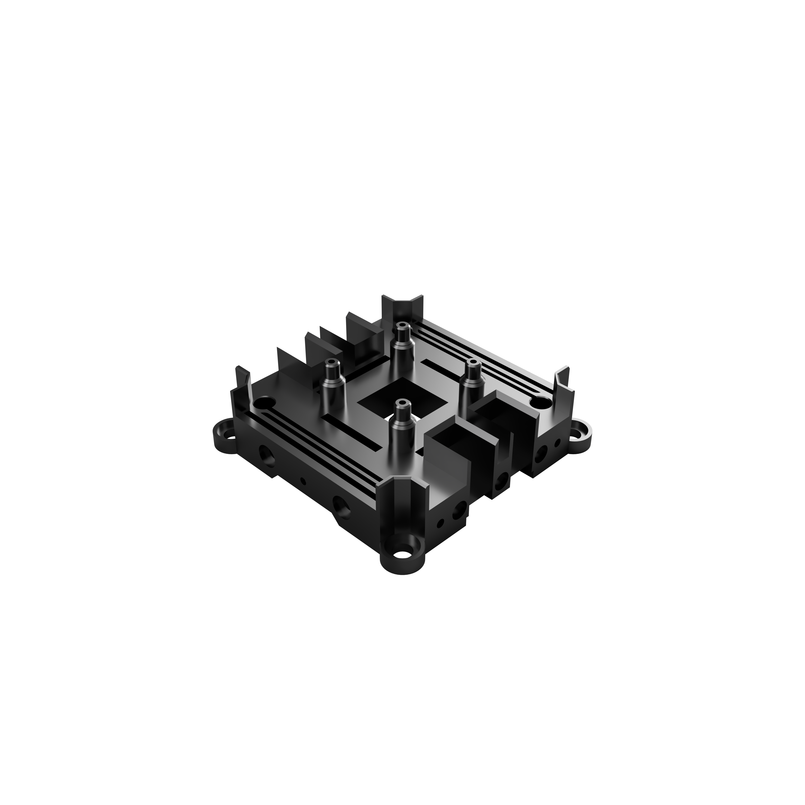

# trappyframe

`trappyframe` is a **low-cost** and **open-source** microscopy system that is **highly customisable**. It is an inverted **low-magnification system** (1-2X) that is built on a 3D printed opto-mechanical cage system, simple optics, and the Raspberry Pi Hardware ecosystem. This system was **build for parallelisation**. Multiple units can be assembled, mounted, and operated in parallel. The microscope can be printed and assembled in any laboratory/school/home with a few simple tools. 

The microscope is primarily designed to **track motile algae**. However, it can be used as it is or customised for any general microscopy requiremnt. 

Instructions on parallelisation, including the assmmbly of a Raspberry Pi cluster/bramble can be found in the parallel project [Trappy-Scopes/raspberry_shrub](https://github.com/Trappy-Scopes/raspberry_shrub/tree/main). The control layer software can be found in the parallel project [Trappy-Scopes/trappyscopes](https://github.com/Trappy-Scopes/trappyscopes) and instructions to configure it for `trappyframe` can be found in the [here](docs/notes/software_configuration.md).

## Microscope Frame

Out compact microscopy frame can be 3D-printed with a commercial 3D printer and be parallelised.

<table align="center" border="0" cellspacing="20">
  <tr>
    <td align="center" border="0">
        
      </a> <b>Single Unit</b>
    </td>
    <td align="center">
        
        </a> <b>Parallelised Cluster</b>
</table>

## Specialised Cage System

<table align="center" border="0" cellspacing="20" style="width:100%;">
  <colgroup>
    <col style="width:35%;">
    <col style="width:65%;">
  </colgroup>
  <tr>
    <td align="center">
       
    </td>
    <td align="left">
      <h4>Camera mount base plate</h4>
      Specialised cage-system components that serve specific purposes like camera mounting, sample holding, etc rely on flexure mechanisms to hold position. This makes assembly simpler by eliminating the need for thread inserts.
    </td>
  </tr>
</table>

## Build on a standard block template

A standard block template was used  to design every component. The templates support a **60mm cage footprint** with **6mm support rods**.

<iframe
  style="width:100%; height:400px; border:none;"
  srcdoc='
    
    <model-viewer
      src="https://raw.githubusercontent.com/Trappy-Scopes/trappyframe/69a5afcf80012a002b0ecb415eb8199e39919581/trappyframe/block_templates/trappyframe_60mm_component_template_v1.glb"
      alt="60mm component template"
      auto-rotate
      camera-controls
      shadow-intensity="0.4"
      exposure="1"
      style="width:100%; height:100%; background-color:transparent;">
    </model-viewer>
  '>
</iframe>

|                          |                                  |                              |
| ------------------------ | -------------------------------- | ---------------------------- |
| Component Block Template | Component Block Template w Studs | Frame Support Block Template |

## Magnetic box to keep away stray light

## Scope of this repository

1. Repository for the 3D models of cage system components: [trappyframe](/trappyframe)
2. Repository for other bill of materials (BOM): [BOM](/docs/notes/bom.md)
3. Easy assembly instructions: [Assembly Instructions](/docs/notes/assembly_instructions.md)

## Frame Components

Notes:

1. The rod holes are currently set to 6.3mm corresponding to the specific 3D printer and nozzle sizes. Ity might have to be modified based on your settings.
2. 3D printer used: Bambu Lab X1E 0.4mm nozzle.
3. Filament of choice: PLA Black 3D.

| No   | Peripheral                                | Filename                                                     | Latest versionª |
| ---- | ----------------------------------------- | ------------------------------------------------------------ | --------------- |
| -    | **TOP - Illumination controller**         | -                                                            | -               |
| 1    | Top plate (frame support)                 | [Top Plate w Magnets(FSSBTv2) v13.stl]("frame/Top%20Plate%20w%20Magnets(FSSBTv2)%20v13.stl") | 13              |
| 2    | LED mount plate                           | [SBTv2 LED mount w studs v11.stl](frame/SBTv2%20LED%20mount%20w%20studs%20v11.stl) | 11              |
| 3    | Condensor mount plate                     | [Condensor Mount 25mm wo tube  (SBTv2) v3 6.3mm rod holes.stl](/frame/Condensor%20Mount%2025mm%20wo%20tube%20%20(SBTv2)%20v3%206.3mm%20rod%20holes.stl) | 3               |
| 4    | Sample stage plate                        | [Sample Mount Agile w Small magnets (SBTv2) v7.stl](/frame/Sample%20Mount%20Agile%20w%20Small%20magnets%20(SBTv2)%20v7.stl) | 7               |
| 5    | Mid plate (frame support)                 | [Mid Plate Magnets 6.3mm  (FSSBTv2) v14.stl](/frame/Mid%20Plate%20Magnets%206.3mm%20%20(FSSBTv2)%20v14.stl) | 14              |
| 6    | Tube lens upper mount plate               | [Tube Lens Holder 6.3 upper (SBTv2) v2.stl](/frame/Tube%20Lens%20Holder%206.3%20upper%20(SBTv2)%20v2.stl) | 2               |
| 7    | Tube lens lower mount plate               | [Tube Lens Holder 6.3 lower (SBTv2) v3.stl](/frame/Tube%20Lens%20Holder%206.3%20lower%20(SBTv2)%20v3.stl) | 3               |
| 8    | Base plate w camera mount (frame support) | [Base Plate 6.3mm (FSSBTv3) v2.stl](/frame/Base%20Plate%206.3mm%20(FSSBTv3)%20v2.stl) | 2               |
| -    | **BOTTOM - Breadboard**                   | [ThorLabs MB3060/M](https://www.thorlabs.com/thorproduct.cfm?partnumber=MB3060/M) | -               |

ª : the version numbers correspond to the filename version for Fusion 365. 

## Standard Block Templates

The parts are designed from standard design blocks. Two different versions exist. One for the normal parts, and one for parts which support the rods, and the box for the frame.

| No   | Peripheral Block Template                     | Filename                                      | Latest versionª |
| ---- | --------------------------------------------- | --------------------------------------------- | --------------- |
| 1    | Standard block template (SBT)                 | [SBTv2 v3.stl](frame_templates/SBTv2.stl)     | 2               |
| 2    | Frame support standard block template (FSSBT) | [FSSBTv3 v3.stl](frame_templates/FSSBTv3.stl) | 3               |

ª : the version numbers correspond to the filename version for Fusion 365. 
