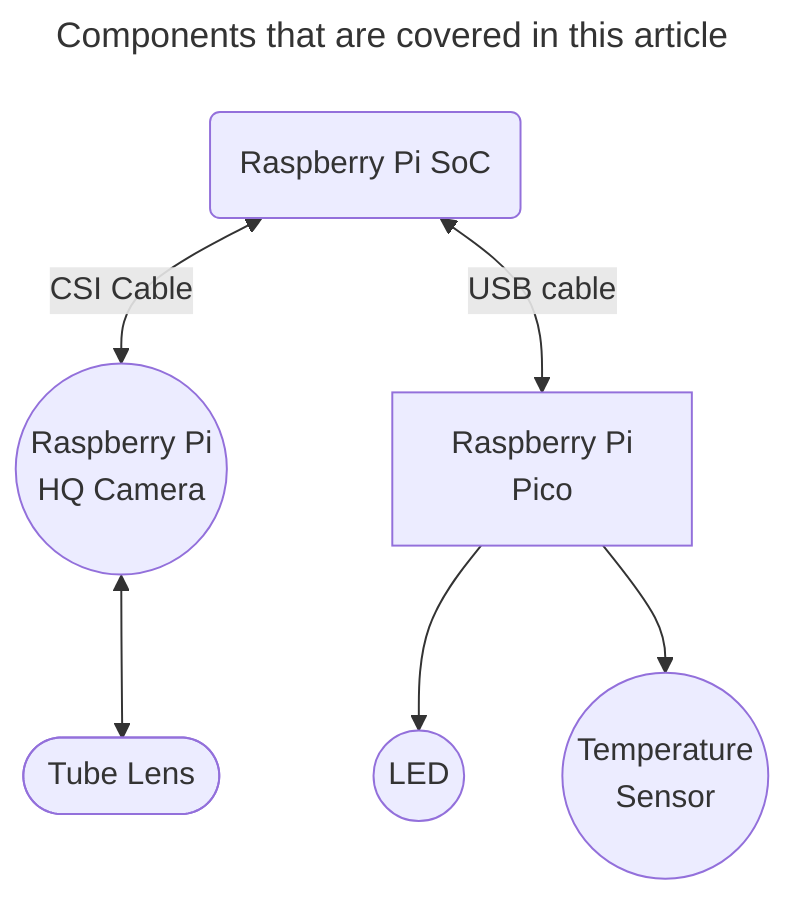
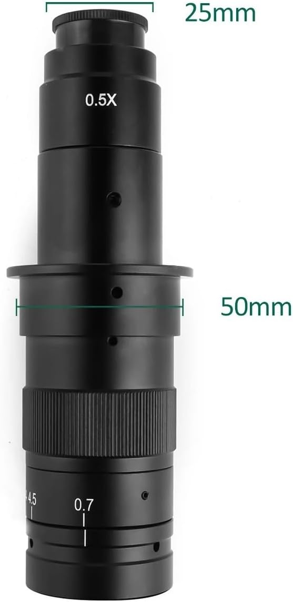

# Electronics & Optics

Optics and electronics can be customised to the specific needs. This note in particular covers the use of a commercial Tube-Lens as a low-magnification objective. The Tube Lens is coupled to a **Raspberry Pi HQ Camera**, which connects to a **Raspberry Pi SoC**.  For electronics, we describe a universal controller framework based on the Raspberry Pi pico microcontroller that can be used to control illumination, and temperature senosors. 

The microcontroller plateform allows for arbitrary customisation. This topic is developed separately in the [Trappy-Scopes/electronics](https://github.com/Trappy-Scopes/electronics) which contains instructions on how to assemble very simple eletronic circuits. Most of the magic happens in code and the `micropython` firmware for the microcontroller platform can be found in the [Trappy-Scopes/pico_firmware](https://github.com/Trappy-Scopes/pico_firmware).

# Raspberry Pi Ecosystem Components

All the information can be found here: https://www.raspberrypi.com/. The website also featues offical resellers specific to all countries.

## System on Chip (Soc)

We use Raspberry Pi 4B, however Raspberry Pi 5 and to some extent lower models are also fine. We recommend using a high RAM version — 8GB. This needs to be coupled with a microSD card, we reommmend a decent 128GB card. Higher memory can be unstable, but upto 128GB works well and has been extensively tested. We will also need connector cables, which are listed in the Bill of Materials page.

1. [SoC Product homepage](https://www.raspberrypi.com/products/raspberry-pi-4-model-b/)

## HQ Camera

1. [Camera Product Guide](https://www.raspberrypi.com/products/raspberry-pi-high-quality-camera/)
2. [Camera CSI connector cable](https://www.raspberrypi.com/products/camera-cable/)

## Pico microcontroller board

We use the pico series 1 board, but newer version boards should also work well. To make the code compatible with other versions, or boards, please remeber to update the pin assignments for that particular board. 

1. [Product Homepage](https://www.raspberrypi.com/products/raspberry-pi-pico/)

# Temperature Sensors

1. 

## Optics

